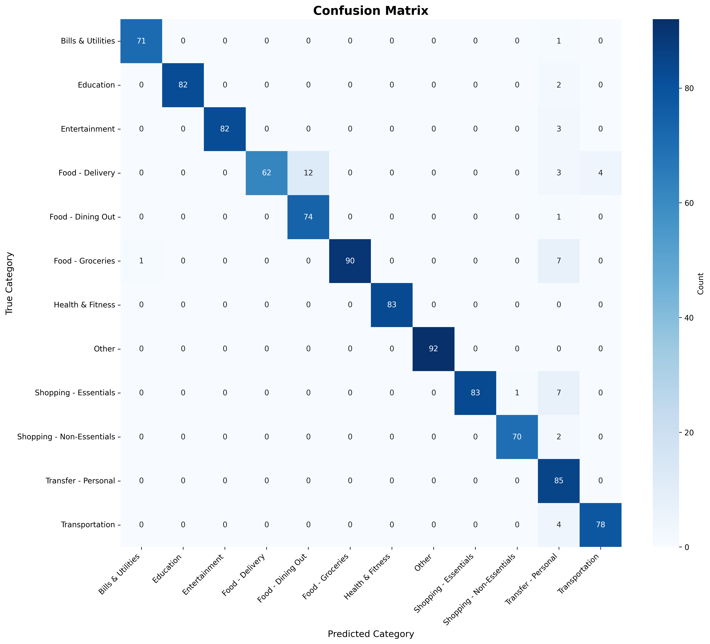
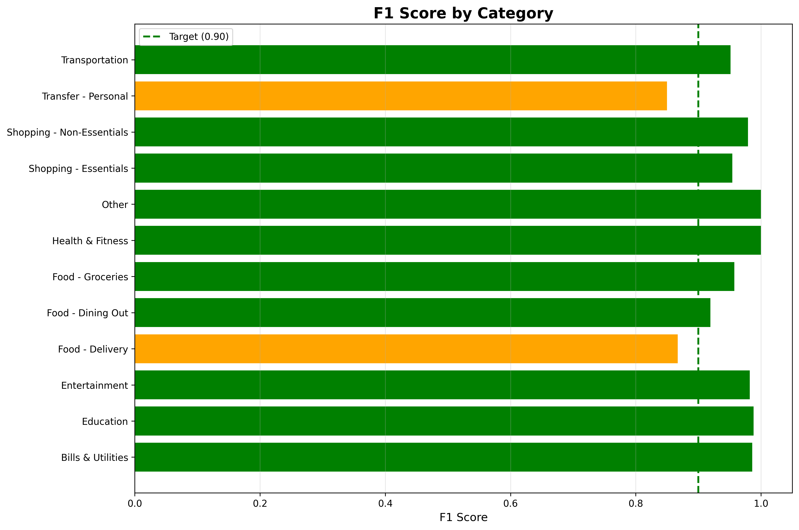

# SmartLabel Evaluation Report

**Generated:** 2025-11-19 22:24:28

---

## Executive Summary

- **Macro F1 Score:** 0.9528
- **Target Achievement:** PASSED (>=0.90)
- **Overall Accuracy:** 0.9520

---

## Per-Category Performance

| Category | Precision | Recall | F1-Score | Support |
|----------|-----------|--------|----------|---------|
| Bills & Utilities | 0.986 | 0.986 | 0.986 | 72 |
| Education | 1.000 | 0.976 | 0.988 | 84 |
| Entertainment | 1.000 | 0.965 | 0.982 | 85 |
| Food - Delivery | 1.000 | 0.765 | 0.867 | 81 |
| Food - Dining Out | 0.860 | 0.987 | 0.919 | 75 |
| Food - Groceries | 1.000 | 0.918 | 0.957 | 98 |
| Health & Fitness | 1.000 | 1.000 | 1.000 | 83 |
| Other | 1.000 | 1.000 | 1.000 | 92 |
| Shopping - Essentials | 1.000 | 0.912 | 0.954 | 91 |
| Shopping - Non-Essentials | 0.986 | 0.972 | 0.979 | 72 |
| Transfer - Personal | 0.739 | 1.000 | 0.850 | 85 |
| Transportation | 0.951 | 0.951 | 0.951 | 82 |

---

## Key Insights

### Top Misclassifications

- **Food - Delivery** -> Food - Dining Out (12 times)
- **Food - Groceries** -> Transfer - Personal (7 times)
- **Shopping - Essentials** -> Transfer - Personal (7 times)
- **Food - Delivery** -> Transportation (4 times)
- **Transportation** -> Transfer - Personal (4 times)

---

## Visualizations

---

## Recommendations

1. Review and improve categories with F1 < 0.85
2. Add more training data for frequently misclassified patterns
3. Fine-tune confidence thresholds for optimal active learning
